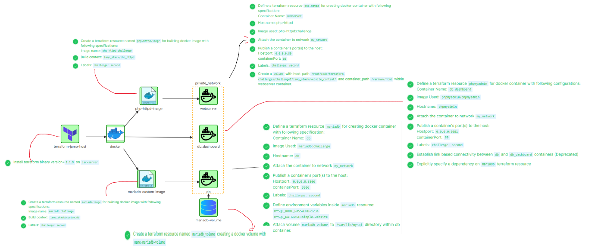

# 🚀 Terraform Docker Challenge 2

This challenge demonstrates how to provision a **multi-container LAMP stack environment** using **Terraform** and the **Docker provider**.
The setup includes a **custom PHP web server**, a **MariaDB database**, and a **phpMyAdmin dashboard**, all running inside Docker containers and managed with Terraform.

---

## 📌 Challenge Overview

We will use Terraform to:

1. Install Terraform binary on the jump host.
2. Build custom Docker images for **PHP (httpd)** and **MariaDB**.
3. Create a **Docker network** to enable communication between containers.
4. Define Terraform resources to launch Docker containers:

   * **Web Server (php-httpd)**
   * **Database (MariaDB)**
   * **phpMyAdmin Dashboard**
5. Configure **volumes, environment variables, ports, and labels**.
6. Manage **dependencies** between containers.

---

## 🛠️ Prerequisites

* Terraform `v1.1.5` installed on the **IAC server (jump host)**
* Docker installed and running
* Basic understanding of Terraform and Docker

---

## ⚙️ Architecture

The setup consists of:



* **Terraform Jump Host** → Executes Terraform code.
* **Docker Daemon** → Runs containers.
* **Private Network (my\_network)** → Allows inter-container communication.
* **Custom Docker Images**:

  * `php-httpd:challenge`
  * `mariadb:challenge`
* **Containers**:

  * `webserver` (PHP HTTPD)
  * `db` (MariaDB)
  * `db_dashboard` (phpMyAdmin)
* **Volumes**:

  * `mariadb-volume` (persistent storage for database)
  * Website content volume for `webserver`.

---

## 🐳 Docker Image Build

### 1️⃣ PHP HTTPD Image

```hcl
resource "docker_image" "php-httpd-image" {
  name = "php-httpd:challenge"
  build {
    context = "lamp_stack/php_httpd"
  }
  labels = {
    challenge = "second"
  }
}
```

### 2️⃣ MariaDB Custom Image

```hcl
resource "docker_image" "mariadb-image" {
  name = "mariadb:challenge"
  build {
    context = "lamp_stack/custom_db"
  }
  labels = {
    challenge = "second"
  }
}
```

---

## 📦 Docker Containers

### 1️⃣ Web Server (php-httpd)

* **Name**: `webserver`
* **Hostname**: `php-httpd`
* **Image**: `php-httpd:challenge`
* **Ports**: `8080:80`
* **Volume**: Website content → `/var/www/html`
* **Labels**: `challenge=second`

### 2️⃣ MariaDB Container

* **Name**: `db`
* **Hostname**: `db`
* **Image**: `mariadb:challenge`
* **Ports**: `3306:3306`
* **Environment Variables**:

  * `MYSQL_ROOT_PASSWORD=1234`
  * `MYSQL_DATABASE=simple-website`
* **Volume**: `mariadb-volume` → `/var/lib/mysql`
* **Labels**: `challenge=second`

### 3️⃣ phpMyAdmin Dashboard

* **Name**: `db_dashboard`
* **Hostname**: `phpmyadmin`
* **Image**: `phpmyadmin/phpmyadmin`
* **Ports**: `8081:80`
* **Labels**: `challenge=second`
* **Depends On**: `mariadb`

---

## 🗂️ Docker Volumes

### MariaDB Volume

```hcl
resource "docker_volume" "mariadb_volume" {
  name = "mariadb-volume"
}
```

### Website Content Volume (bind mount)

* Host Path: `./lamp_stack/website_content`
* Container Path: `/var/www/html`

---

## 🌐 Networking

All containers are connected to a **private user-defined Docker network**:

```hcl
resource "docker_network" "private_network" {
  name       = "my_network"
  attachable = true
  labels = {
    challenge = "second"
  }
}
```

---

## ✅ Execution Steps

1. Clone the project and move into the directory:

   ```bash
   git clone <repo_url>
   cd terraform-docker-challenge2
   ```
2. Initialize Terraform:

   ```bash
   terraform init
   ```
3. Validate configuration:

   ```bash
   terraform validate
   ```
4. Apply the configuration:

   ```bash
   terraform apply -auto-approve
   ```
5. Verify containers:

   ```bash
   docker ps
   ```

---

## 📊 Ports & Access

* **Web Server (php-httpd)** → [http://localhost:8080](http://localhost:8080)
* **phpMyAdmin Dashboard** → [http://localhost:8081](http://localhost:8081)

  * Host: `db`
  * User: `root`
  * Password: `1234`

---

## 🎯 Key Learnings

* Managing **Docker containers with Terraform**
* Building and using **custom Docker images**
* Configuring **volumes, environment variables, and networking** in Terraform
* Establishing dependencies and communication between multiple services

---
